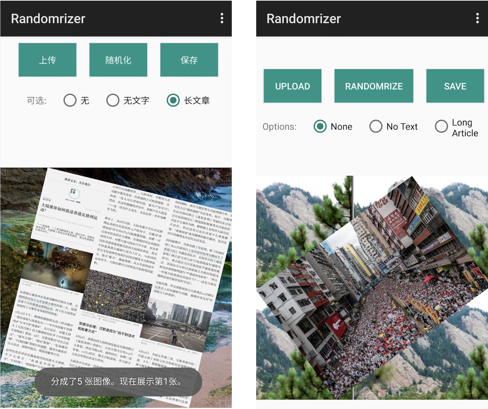

# Randomrizer

Randomrizer is an Android app that can randomrize an image for easy distribution, and avoiding machine comprehension.

------------------------------------
This app was inspired by two reports from the Citizen Lab.  
 [(Can’t) Picture This: An Analysis of Image Filtering on WeChat Moments](https://citizenlab.ca/2018/08/cant-picture-this-an-analysis-of-image-filtering-on-wechat-moments/)  
 [ (Can’t) Picture This 2: An Analysis of WeChat’s Realtime Image Filtering in Chats ](https://citizenlab.ca/2019/07/cant-picture-this-2-an-analysis-of-wechats-realtime-image-filtering-in-chats/)

## How it works

According to the two reports, images could avoid been detected by  simple transformations, such as rotation, aspect ratio change or change in MD5 hash.  

An image processed by Randomrizer will randomly go through the following steps.

* Rotate
* Background change
* Remove meta data
* Mirroring
* Blurring
* Aspect ration change

## Download & Install

Please download .apk from the release page.

## Usage

1. Clone
2. Open in Andriod Studio
3. Add OpenCV support according to [this](https://blog.codeonion.com/2015/11/25/creating-a-new-opencv-project-in-android-studio/)

## TODO
Further improvements can be added:
* Overlay random sketches on images
* Hide texts to luminosity to trick OCR
* Randomly repeating and shifting

## License

This project is licensed under the [WTFPL](LICENSE) - do whatever you want with it.

We encourage people with the expertise to convert this project to iOS or web platform.

## Acknowledgments

* 
Icons made by <a href="https://www.flaticon.com/authors/pixel-perfect" title="Pixel perfect">Pixel perfect</a> from <a href="https://www.flaticon.com/"                 title="Flaticon">www.flaticon.com</a> is licensed by <a href="http://creativecommons.org/licenses/by/3.0/"                 title="Creative Commons BY 3.0" target="_blank">CC 3.0 BY</a>

